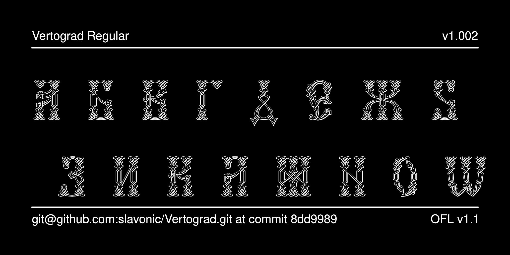

# Vertograd Decorative Typeface

Vertograd is a typeface used for decorative drop caps (*bukvitsi*) in liturgical books of the Russian Orthodox Church published since the late 19th century.



## History

The font was originally designed by Vlad Dorosh as Vertograd UCS for
the [Irmologion project](http://irmologion.ru/fonts.html#Vertograd).
It was then released under the LaTeX Project Public License
as part of [CSLTeX](https://sites.google.com/site/csltex/).
Next, it was reencoded for Unicode by Aleksandr Andreev and released as Vertograd Unicode, part of the
[Slavonic Computing Initiative](https://sci.ponomar.net/fonts.html), and released under SIL OFL v. 1.1.
Edited by Aleksandr Andreev.

## License

This Font Software is licensed under the SIL Open Font License,
Version 1.1. This license is available with a FAQ at
[https://openfontlicense.org/](https://openfontlicense.org/).

## Building the Fonts

The font is built using fontmake and gftools post processing script. Tools are all python based, so it must be previously installed.

To install all the Python tools into a virtualenv, do the following:

From terminal:

```

cd your/local/project/directory

#once in the project folder create a virtual environment. 
This step has to be done just once, the first time:

python3 -m venv venv

#activate the virtual environment

source venv/bin/activate

#install the required dependencies

pip install -r requirements.txt

```

Then run the this command:

```
cd sources
gftools builder config.yaml
```

The fonts are supposed to build automatically in the repository 
using GitHub Actions, but this does not work correctly 
for some reason.

## Features

There are no specialized features. Only glyphs used in *bukvitsy* are provided in the font.

## More Church Slavonic Fonts

See the [main repository](https://github.com/typiconman/fonts-cu/issues) and the [website](https://sci.ponomar.net/fonts.html).
